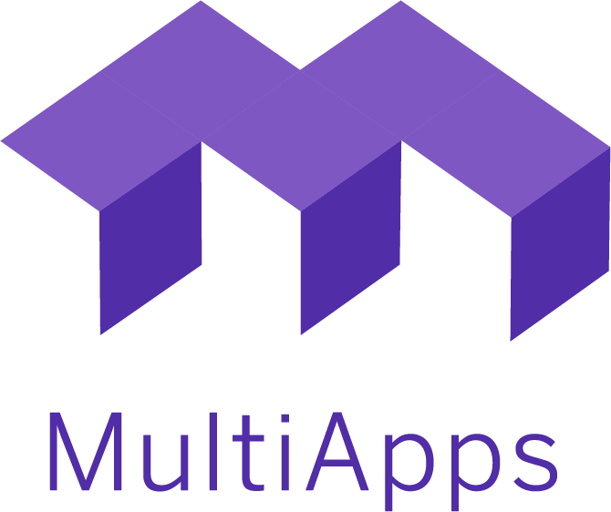

<p align="center"></p>

# MultiApps CF CLI Plugin [](https://travis-ci.org/cloudfoundry-incubator/multiapps-cli-plugin)
This is a Cloud Foundry CLI plugin (formerly known as CF MTA Plugin) for performing operations on [multi-target applications (MTAs)](https://www.sap.com/documents/2016/06/e2f618e4-757c-0010-82c7-eda71af511fa.html) in Cloud Foundry, such as deploying, removing, viewing, etc. It is a client for the [CF MultiApps Controller](https://github.com/cloudfoundry-incubator/multiapps-controller) (formerly known as CF MTA deploy-service), which is an MTA deployer implementation for Cloud Foundry.

# Requirements
- Installed CloudFoundry CLI - ensure that CloudFoundry CLI is installed and working. For more information about installation of CloudFoundry CLI, please visit the official CloudFoundry [documentation](https://docs.cloudfoundry.org/cf-cli/install-go-cli.html). CloudFoundry CLI v7 beta is not supported. You need to have v6.4x
- Working [CF MultiApps Controller](https://github.com/cloudfoundry-incubator/multiapps-controller) - this a CF plugin for the MultiApps Controller application. Thus, a working MultiApps Controller must be available on the CF landscape

# Download and Installation

:rotating_light: Check whether you have a previous version installed, using the command: `cf plugins`. If the MtaPlugin is already installed, you need to uninstall it first and then to install the new version. You can uninstall the plugin using command `cf uninstall-plugin MtaPlugin`.

## CF Community Plugin Repository

The MultiApps CF CLI Plugin is now also available on the CF Community Repository. To install the latest available version of the MultiApps CLI Plugin execute the following:

`cf install-plugin multiapps`

If you do not have the community repository in your CF CLI you can add it first by executing:

`cf add-plugin-repo CF-Community https://plugins.cloudfoundry.org`

## Manual Installation

Alternatively you can install any version of the plugin by manually downloading it from the releases page and installing the binaries for your specific operating system.

### Download
The latest version of the plugin can also be downloaded from the project's [releases](https://github.com/cloudfoundry-incubator/multiapps-cli-plugin/releases/latest/). Download the plugin for your platform (Darwin, Linux, Windows). 

OS | Link |
--- | --- |
Mac OS X | <https://github.com/cloudfoundry-incubator/multiapps-cli-plugin/releases/latest/download/multiapps-plugin.osx> |
Windows 32 bit | <https://github.com/cloudfoundry-incubator/multiapps-cli-plugin/releases/latest/download/multiapps-plugin.win32> |
 Windows 64 bit |  <https://github.com/cloudfoundry-incubator/multiapps-cli-plugin/releases/latest/download/multiapps-plugin.win64> |
Linux 32 bit |  <https://github.com/cloudfoundry-incubator/multiapps-cli-plugin/releases/latest/download/multiapps-plugin.linux32> |
Linux 64 bit | <https://github.com/cloudfoundry-incubator/multiapps-cli-plugin/releases/latest/download/multiapps-plugin.linux64> |


multiapps-plugin.osx | multiapps-plugin.win32 | multiapps-plugin.win64 | multiapps-plugin.linux32 | multiapps-plugin.linux64

### Installation
Install the plugin, using the following command:
```
cf install-plugin <path-to-the-plugin> -f
```
:rotating_light: Note: if you are running on an Unix-based system, you need to make the plugin executable before installing it. In order to achieve this, execute the following commad `chmod +x <path-to-the-plugin>`

## Usage
The MultiApps CF plugin supports the following commands:

Command Name | Command Description
--- | ---
`deploy` | Deploy a new multi-target app or sync changes to an existing one
`undeploy` | Undeploy (remove) a multi-target app
`mtas` | List all multi-target apps
`mta` | Display health and status for a multi-target app
`mta-ops` | List active multi-target app operations
`download-mta-op-logs` / `dmol` | Download logs of multi-target app operation
`bg-deploy` | Deploy a multi-target app using blue-green deployment
`purge-mta-config` | Purge stale configuration entries

For more information, see the command help output available via `cf [command] --help` or `cf help [command]`.

Here is an example deployment of the open-sourced [spring-music](https://github.com/nvvalchev/spring-music):
```
git clone https://github.com/nvvalchev/spring-music.git
cf deploy mta-assembly/spring-music.mtar -e config.mtaext
```

# Configuration     
The configuration of the MultiApps CF plugin is done via env variables. The following are supported:
* `DEBUG=1` - Enables the logging of HTTP requests in `STDOUT` and `STDERRR`.
* `MULTIAPPS_CONTROLLER_URL=<URL>` - By default, the plugin attempts to deduce the multiapps-controller URL based on the available shared domains. In case of issues, or if you want to target a non-default multiapps-controller instance, you can configure the targeted URL via this env variable.
* `MULTIAPPS_UPLOAD_CHUNK_SIZE=<POSITIVE_INTEGER>` - By default, large MTARs are not uploaded as a single unit, but are split up into smaller chunks of 45 MBs that are uploaded separately. The goal is to prevent failed uploads due to [gorouter](https://github.com/cloudfoundry/gorouter)'s request timeout. In case the default chunk size is still too large, you can configure it via this environment variable. **The specified values are in megabytes.**
:rotating_light: Note: The total number of chunks in which an MTAR is split cannot exceed 50, since the multiapps-controller could interpret bigger values as a denial-of-service attack. For this reason, the minimum value for this environment variable is computed based on the formula: `MIN = MTAR_SIZE / 50`
For example, with a 100MB MTAR the minimum value for this environment variable would be 2, and for a 400MB MTAR it would be 8. Finally, the minimum value cannot grow over 50, so with a 4GB MTAR, the minimum value would be 50 and not 80.

# How to contribute
* [Did you find a bug?](CONTRIBUTING.md#did-you-find-a-bug)
* [Do you have a question or need support?](CONTRIBUTING.md#do-you-have-a-question-or-need-support)
* [How to develop, test and contribute to MultiApps CF Plugin](CONTRIBUTING.md#do-you-want-to-contribute-to-the-code-base)

# Development

*WARNING* : with [Issue 117](https://github.com/cloudfoundry-incubator/multiapps-cli-plugin/issues/117) the master branch of this repository as well as other artifacts will be renamed. Adaptation to any CI/CD infrastructure & scritps will be required.

## Cloning the repository
To clone the project in your Go workspace `$GOPATH/src/github.com/cloudfoundry-incubator/multiapps-cli-plugin` execute the following commands:
```
mkdir -p $GOPATH/src/github.com/cloudfoundry-incubator
cd $GOPATH/src/github.com/cloudfoundry-incubator
git clone git@github.com:cloudfoundry-incubator/multiapps-cli-plugin.git
```

## Building new release version
You can automatically build new release for all supported platforms by calling the build.sh script with the version of the build.
The version will be automatically included in the plugin, so it will be reported by `cf plugins`.

:rotating_light: Note that the version parameter should follow the semver format (e.g. 1.2.3).
```bash
./build.sh 1.2.3
```

This will produce `mta_plugin_linux_amd64`, `mta_plugin_darwin_amd64` and `mta_plugin_windows_amd64` in the repo's root directory.

## Adding dependency into the multiapps-cli-plugin
#### If you want to add a dependecy which to be used later on during the build and development process, you need to follow these steps:
1.  Make sure that you have godep installed(try to run `godep version`). If you do not have it, run the command: `go get github.com/tools/godep`. !!!IMPORTANT!!! Make sure that you are running on latest version of GO and godep!!!
2.  Get the dependency by executing the command: `go get github.com/<package-full-name>` . If you want to update it use the -u option.
3.  Use the dependecy into your code(just import and use)
4.  Make sure that the dependency is not in the Godeps/Godeps.json file(if it is, delete the entry related to it). Godeps.json file is holding information about all the dependencies which are used in the project.
5.  Run `godep save ./...` - this will add all the newly used dependecies into the Godeps/Godeps.json and into the vendor/ folder.

For more information about the godep tool, please refer to: [godep](https://github.com/tools/godep)

# Further reading
Presentations, documents, and tutorials:
- [Managing Distributed Cloud Native Applications Made Easy (CF Summit EU 2017 slides)](https://www.slideshare.net/NikolayValchev/managing-distributedcloudapps-80697059)
- [Managing Distributed Cloud Native Applications Made Easy (CF Summit EU 2017 video)](https://www.youtube.com/watch?v=d07DZCuUXyk&feature=youtu.be)
- [CF orchestration capabilities by tutorial & example](https://github.com/SAP-samples/cf-mta-examples)

# License

This project is licensed under the Apache Software License, v. 2 except as noted otherwise in the [LICENSE](https://github.com/cloudfoundry-incubator/multiapps-cli-plugin/blob/master/LICENSE) file.

